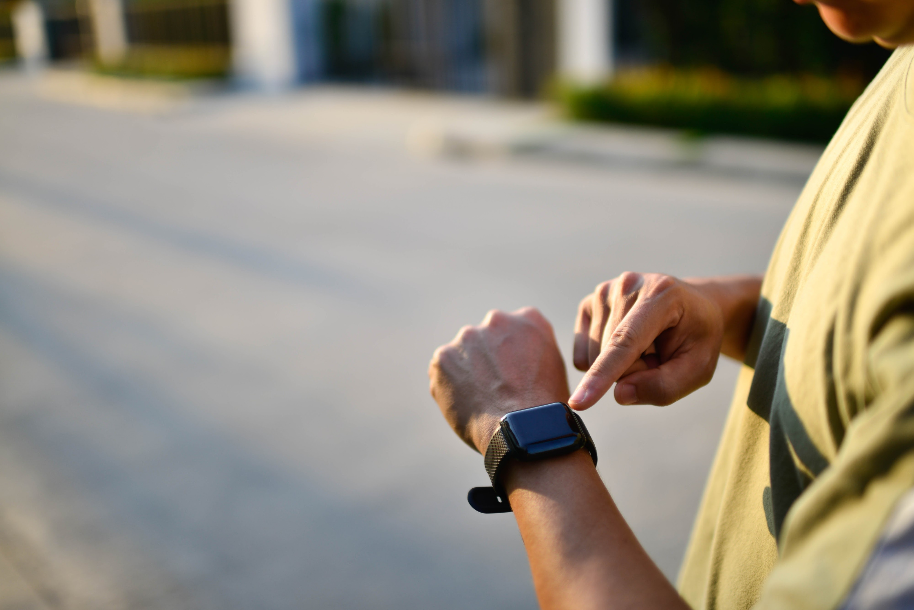
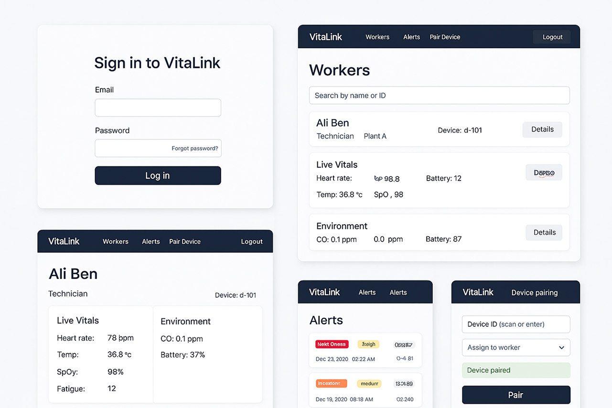
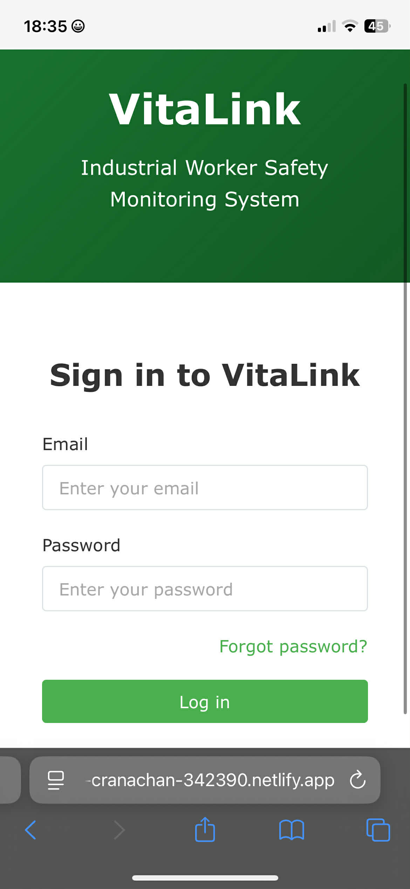
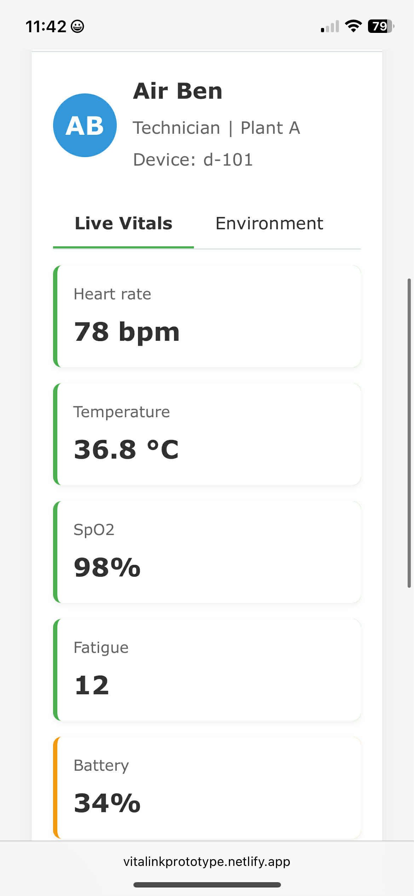
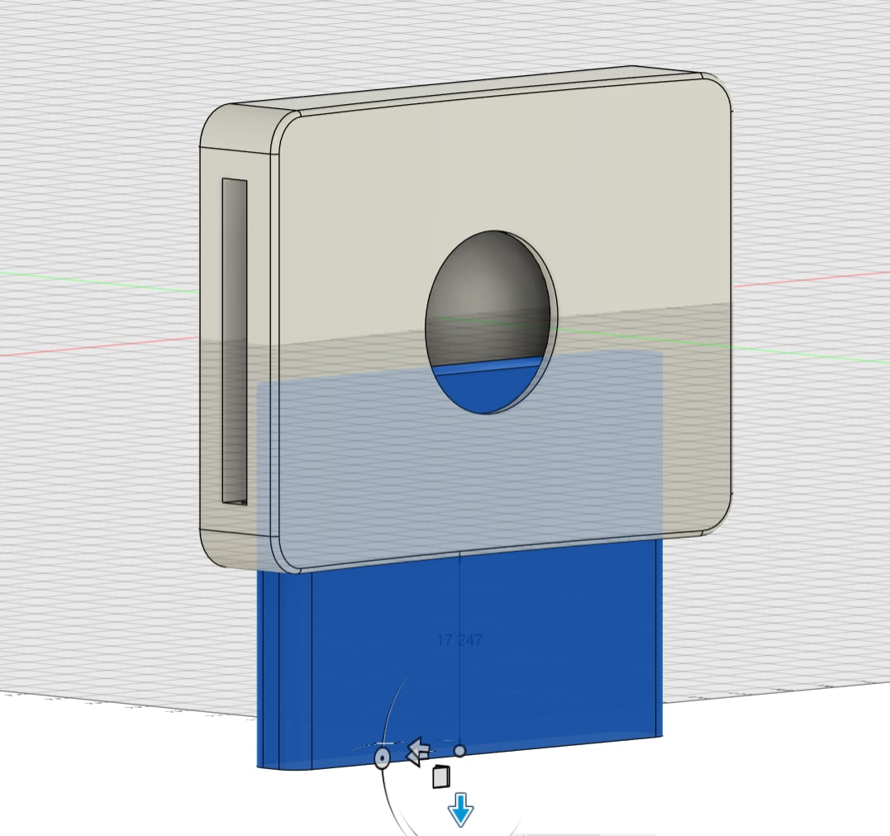
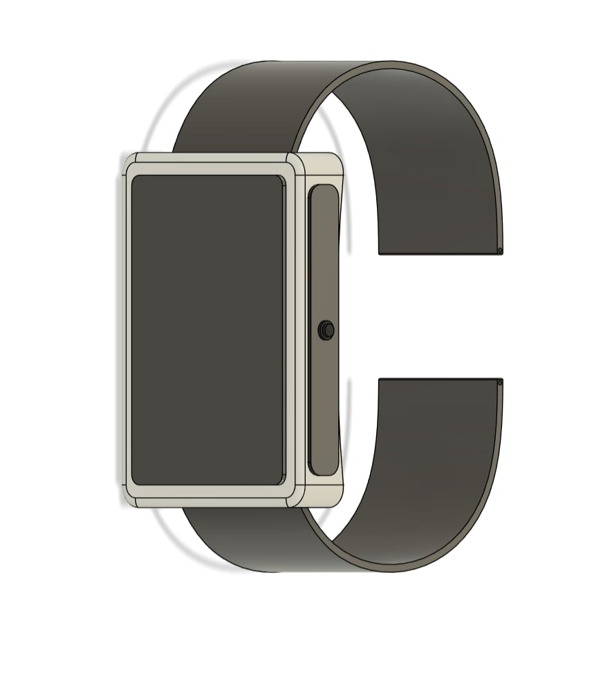
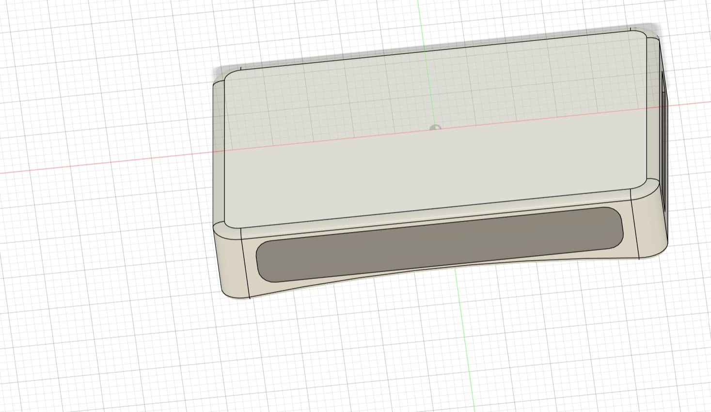
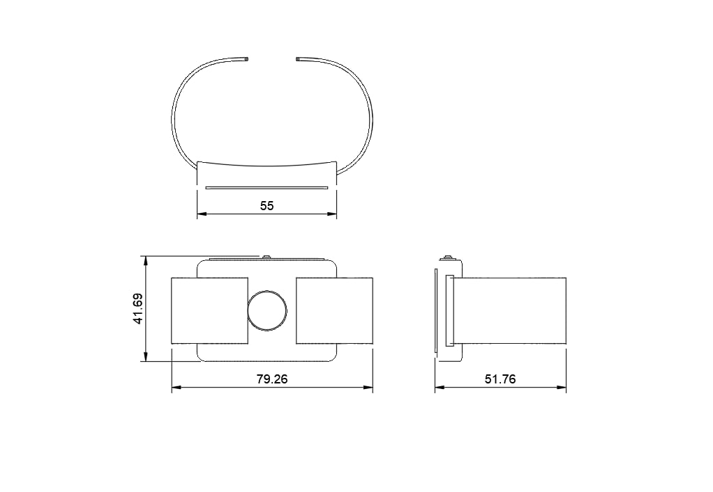
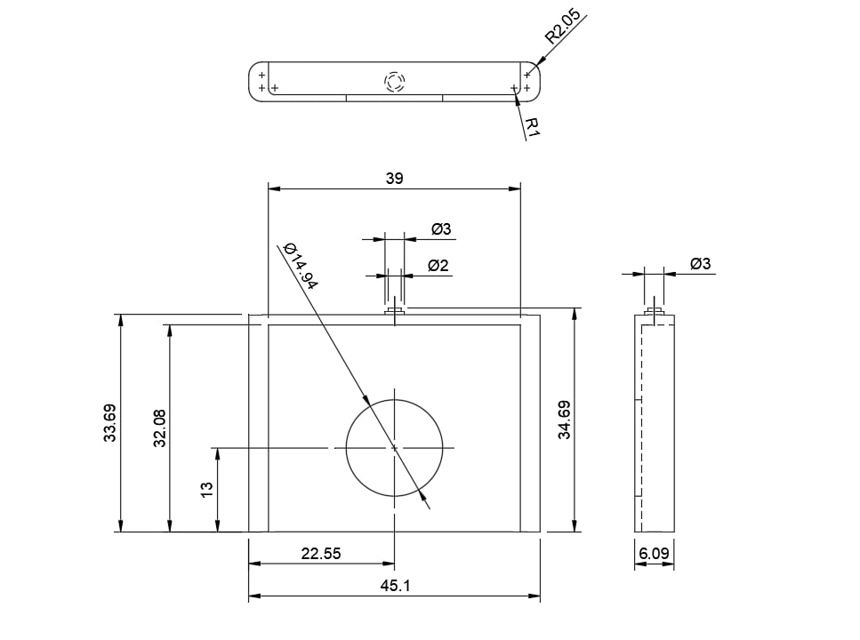

<p align="center">
  
  &nbsp;&nbsp;&nbsp;&nbsp;
  
</p>


# Vitalink — Wearable Telemetry Backbone

A compact, low-power telemetry link designed for smartwatches and wearable devices (Zephyr-based). Vitalink handles secure, authenticated uplinks for sensor telemetry, supports ephemeral tokens for short-lived sessions, and provides pluggable transports (BLE as primary, LoRa optional) tuned for constrained, battery-powered devices.
<p align="center">
  
</p>


## Technical overview
- Language: C (Zephyr RTOS)
- Primary transport: BLE (GATT/ATT, peripheral role for watches), optional LoRa for gateway uplinks
- Security: session keys, AEAD (production: AES-GCM via mbedTLS/tinycrypt). Tests use lightweight XOR emulation.
- Target usage:
  - short telemetry bursts (heart rate, accelerometer, battery)
  - strict duty-cycle and low-power wake/scan windows
  - ephemeral tokens for pairing/authorization with companion phones or backend
- Key modules:
  - src/comm/secure_comm.c — session/key management, token issuance
  - src/transport/ — BLE adapter optimized for low duty cycles and connection intervals
  - samples/watch_app — reference smartwatch application (sensor sampling → secure uplink)

## Our Prototype
- A real-time worker health and safety monitoring dashboard for industrial environments
<p align="center">
  
</p>


## Prerequisites
- Git
- Zephyr SDK and West (https://docs.zephyrproject.org/)
- Python >= 3.8
- Recommended: VS Code with "C/C++" and "Cortex-Debug" extensions
- Hardware: development board with BLE (nRF52 family recommended) or use native_posix for emulation

## User Overview
- Secure login portal for the Vitalink safety monitoring system
-  Live dashboard displaying a worker's real-time health vitals and device status
- Alert and data management settings for configuring safety thresholds
<p align="center">
  
  
  
</p>

## Open the project (quick)
1. Clone:
   git clone <repo-url>
2. Open in VS Code:
   File → Open Folder → select "c:\Users\MSI\Desktop\Vitalink tsyp"
3. Initialize Zephyr (if not already):
   west init -l
   west update
   Source Zephyr environment (bash/WSL): source zephyr-env.sh

## Build & run (native_posix — fast iteration)
- Build the watch sample on host:
  west build -b native_posix samples/watch_app
- Run:
  ./build/zephyr/zephyr
- Native mode emulates sensor input and BLE transport behavior for functional testing.

## Repository Structure
```
├── CMakeLists.txt
├── README.md
├── prj.conf
├── ai/
│   └── train_models.py
├── include/
│   └── vitalink.h
├── scripts/
│   ├── backend.py
│   └── upload_data.py
├── src/
│   ├── main.c
│   ├── ai/                 
│   ├── alert/              
│   ├── comm/               
│   ├── digital_twin/       
│   ├── power/              
│   ├── sensors/            
│   └── storage/            
```

## Testing & validation
- Unit tests:
  west build -t run -b native_posix tests/<test-name>
- Integration: run native_posix or on-device and verify:
  - secure_comm_send/receive round-trip
  - token issuance and short TTL enforcement
  - connection behavior under typical smartwatch duty cycles
## Accuracy To Assess Heart Rate
- The heart-rate sensor in the VitaLink smartwatch monitors workers’ pulse in real time to ensure safety, detect strain early, and support reliable on-the-job health tracking
<p align="center">
  
</p>


## Where To Look
- src/comm/secure_comm.c — session management and token stubs
- src/transport/ — BLE/LoRa adapters and platform hooks
- samples/watch_app — sensor sampling, power management, and example usage

## VitaLink Smartwatch – Concept Design Models
- The 3D model presents a detailed visualization of the VitaLink smartwatch, highlighting its overall shape, body structure, and ergonomic design. It helps demonstrate how sensors, buttons, and internal components are arranged, giving a realistic preview of the final physical device.
<p align="center">  </p>
- The 2D model breaks the smartwatch down into clean technical views, showing precise dimensions, outlines, and component placement. This layout supports the engineering process by ensuring accuracy in sizing, alignment, and integration before moving into full prototyping.
<p align="center">
    
</p>


## BCP Design
- The BCP design forms the protective back cover of the VitaLink smartwatch, securing internal components and ensuring stable sensor contact. It enhances durability, comfort, and reliability in tough work environments.
<p align="center">
  
  
</p>

